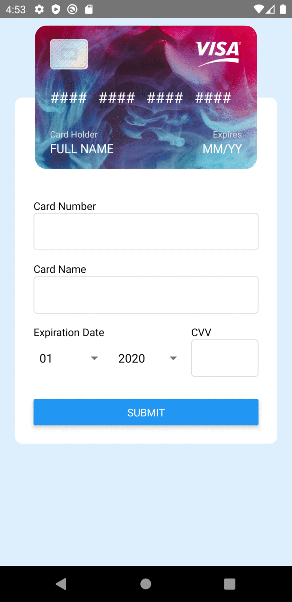

# TDDC73
TDDC73 - Interaction Programming

The course is about learning the principles and programming techniques for advanced graphical user interfaces. This refers to as interaction programming. 

This repository consists of laboratory work and project work. The result of one of the labs is shown below.

